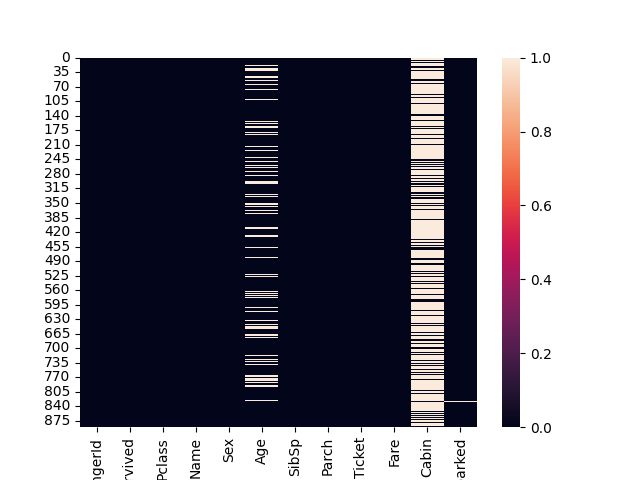

# Titanic Survival Predictor



## Overview
Predicts passenger survival using:
- Exploratory Data Analysis
- Feature engineering
- Logistic Regression

## Key Features
- Family size calculation
- Title extraction from names
- Age imputation by title
- Class/gender survival analysis

## Results
| Metric     | Value  |
|------------|--------|
| Accuracy   | 0.7921 |

## Setup
```bash
git clone https://github.com/snehalagarwall/titanic-survival-predictor
cd titanic-survival-predictor

# Create environment
python -m venv venv
source venv/bin/activate  # Linux/Mac
.\venv\Scripts\activate  # Windows

# Install dependencies
pip install -r requirements.txt
```

## Run Project
```bash
# Run EDA notebook first
jupyter notebook notebooks/01_eda.ipynb

# Then run modeling notebook
jupyter notebook notebooks/02_model.ipynb
```

## Project Structure
```
├── data/       # Raw and processed data
├── notebooks/  # Jupyter notebooks
├── output/     # Models, figures, metrics
```